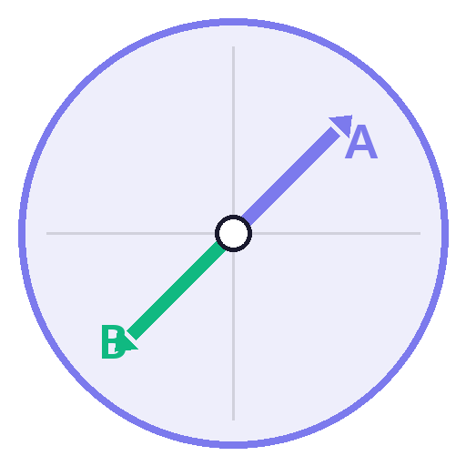
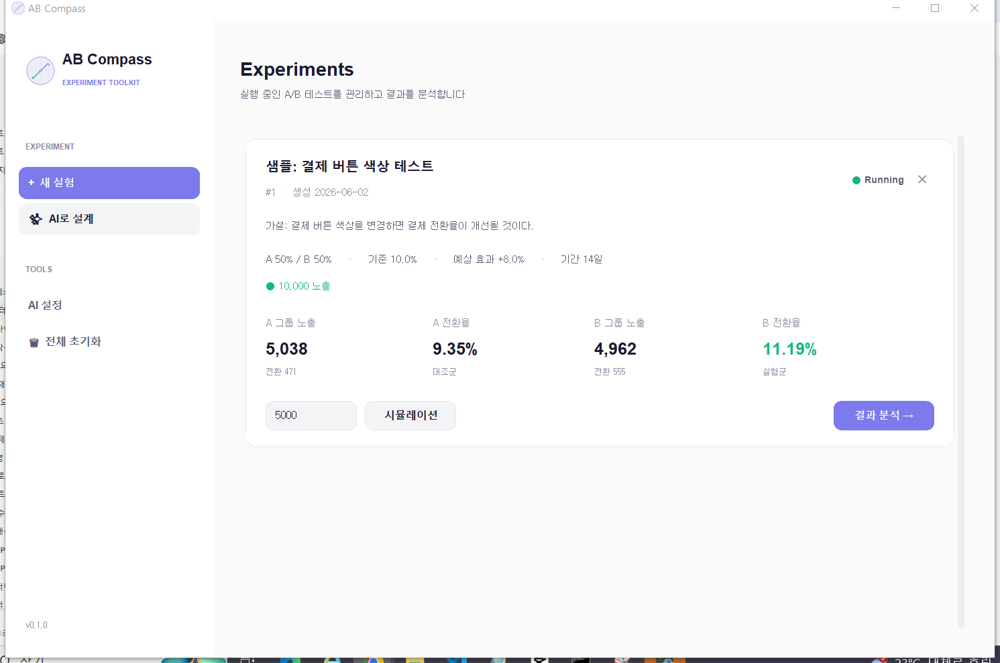
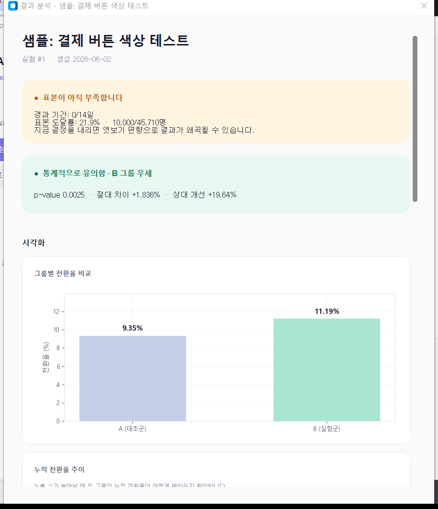
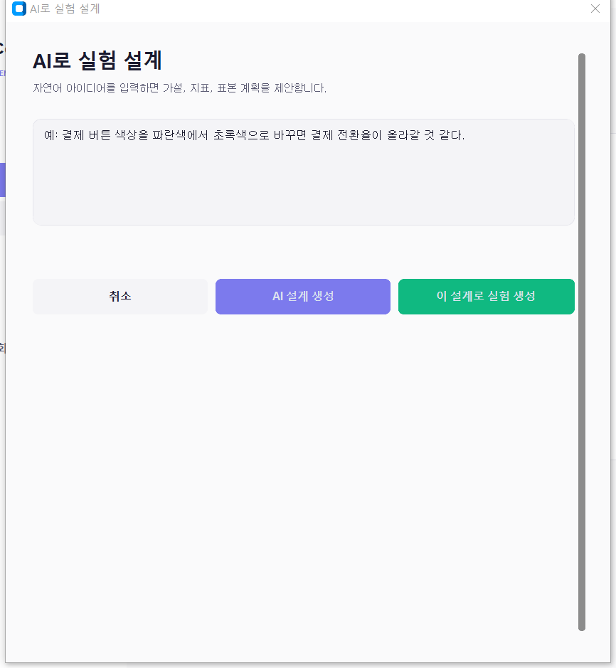
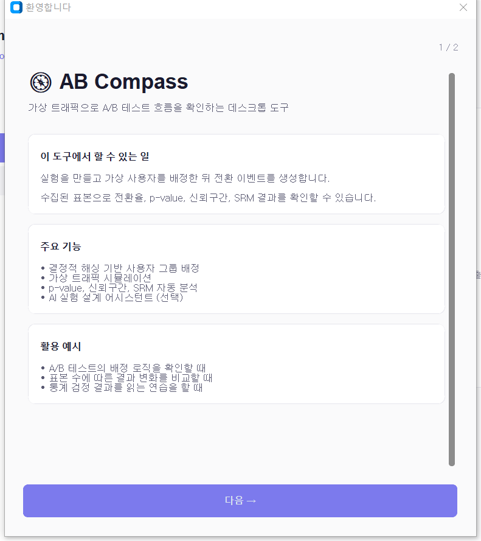

<div align="center">



# AB Compass

A/B 테스트의 방향을 가늠하는 나침반(Compass)이라는 의미.  
플랫폼의 핵심 메커니즘을 직접 구현한 데스크톱 학습 도구.

</div>

---

## 목차

1. [프로젝트 개요](#1-프로젝트-개요)
2. [프로젝트 시작 배경](#2-프로젝트-시작-배경)
3. [주요 분석](#3-주요-분석)
4. [주요 기능](#4-주요-기능)
5. [기술 스택](#5-기술-스택)
6. [분석 범위 및 한계](#6-분석-범위-및-한계)
7. [실행 방법](#7-실행-방법)
8. [향후 확장 계획](#8-향후-확장-계획)
9. [스크린샷](#9-스크린샷)

---

## 1. 프로젝트 개요

| 항목 | 내용 |
|---|---|
| 프로젝트명 | AB Compass |
| 개발 기간 | 2026.03 ~ 2026.05 |
| 구성 | 개인 프로젝트 · 1인 개발 |
| 핵심 기술 | Python · scipy · CustomTkinter · Gemini API |
| 산출물 | Windows 데스크톱 애플리케이션 (`.exe`) |

Statsig, Hackle, Eppo 등 상용 A/B 테스트 플랫폼의 핵심 메커니즘  
(결정적 해싱 기반 그룹 배정 · 통계적 유의성 검정 · 데이터 품질 진단)을  
1인 학습 도구 규모로 재구성. Gemini API를 활용한 가설 설계 어시스턴트 통합.

---

## 2. 프로젝트 시작 배경

업무에서 A/B 테스트 도구(Statsig, Hackle)를 다루면서 결과 화면의 통계량이  
표면적으로만 해석되는 한계를 느꼈고, 핵심 메커니즘을 직접 구현해 보는 것이  
가장 빠른 학습 경로라 판단함.

**해소되지 않았던 네 가지 질문**

- 같은 사용자가 재방문해도 동일 그룹으로 배정되는 메커니즘
- p-value의 계산 절차와 0.05 임계값의 근거
- 신뢰구간과 p-value가 동일한 표준오차를 사용하는지 여부
- 50:50 설정에서 53:47 분포가 관측되었을 때의 정상성 판단 기준

상용 도구의 문서로는 추상적인 수준에서만 이해되어, 5일 범위 내에서 핵심  
메커니즘을 직접 구현하며 검증하는 방식의 분석 프로젝트로 진행함.

---

## 3. 주요 분석

A/B 테스트 플랫폼의 동작 원리를 4개 구성요소로 분해하여 구현함.  
각 구성요소는 상용 도구가 추상화한 핵심 로직을 직접 코드로 재현한 결과물임.

### 3-1. 사용자 그룹 배정 알고리즘

랜덤 배정 시 동일 사용자의 재방문에서 그룹이 변동되어 실험이 오염되는  
구조적 문제 발생. 해시 함수의 결정성을 활용해 일관된 배정을 구현함.

```python
def assign_variant(user_id, salt, ratio):
    key = f"{user_id}:{salt}"
    bucket = int(hashlib.md5(key.encode()).hexdigest(), 16) % 10000 / 10000
    return 'A' if bucket < ratio else 'B'
```

- **일관성**: 동일 사용자는 언제 접속해도 동일 그룹으로 배정
- **독립성**: 실험별 salt 분리로 실험 간 배정 상관관계 제거
- **무상태성**: 서버 조회 없이 클라이언트에서 즉시 결정 가능

Statsig, LaunchDarkly 등 상용 플랫폼의 표준 방식과 동일.

### 3-2. 유의성 검정 및 효과 추정

두 그룹의 전환율 차이가 우연인지 실제 효과인지를 판정하기 위해 z-검정으로  
p-value를 산출하고, 효과의 크기와 불확실성 범위를 95% 신뢰구간으로 추정함.

| 산출 지표 | 활용 |
|---|---|
| p-value | 차이가 우연일 확률 (유의성 판정) |
| 신뢰구간 | 효과 크기의 추정 범위 |
| z-score | 검정 통계량 |
| Lift | A 대비 B의 상대적 개선율 |

검정과 추정이 서로 다른 통계 가정을 사용하므로 표준오차를 분리하여 계산.  
동일 데이터에 두 가지 분석을 적용하는 통계적 디테일을 코드로 구현함.

### 3-3. 데이터 품질 자동 진단

실험 설정 비율과 실제 배정 비율의 일치성을 카이제곱 검정으로 검증.  
50:50 설정에서 53:47 분포가 관측될 경우, 단순 우연인지 배정 로직의 결함인지  
정량적으로 판정함.

- 임계값: `p < 0.001` (Microsoft, Booking.com 실험 가이드 관례)
- 임계값 초과 시 분석을 신뢰하기 전 데이터 파이프라인 점검을 권고
- 상용 도구의 "Data Quality 알림"이 본질적으로 동일 검정의 결과

### 3-4. 의사결정 함정 차단

표본 수가 권장치에 미달한 상태에서 p-value를 조기 확인 후 종료할 경우,  
false positive 비율이 명목 유의수준(5%)을 크게 상회함.

**시뮬레이션 검증**

효과가 동일한 두 그룹으로 실험을 반복할 때, 표본 누적 구간에서 p-value가  
일시적으로 0.05 미만으로 떨어지는 순간이 빈번하게 발생. 해당 시점을 종료  
기준으로 채택하면 false positive 비율이 약 20~30%까지 상승함을 재현.

권장 표본 미달 시 결과 화면에 명시적 경고를 노출하여 잘못된 의사결정을  
사전 차단하는 방식으로 구현.

### 3-5. 참고 문헌

국내 IT 기업의 실험 운영 사례 및 통계 방법론 표준 문헌을 참조함.

- **카카오페이 기술블로그** — 자체 A/B 테스트 플랫폼 구축 시 MVP 접근법
- **토스 기술블로그** — "문제 정의 → 가설 → EDA → 실험 → 확장" 운영 흐름
- **Hackle 기술블로그** — 실무 의사결정 시 통계 함정 사례
- **Kohavi et al., Trustworthy Online Controlled Experiments (2020)** — SRM 임계값 근거

---

## 4. 주요 기능

### 4-1. 핵심 기능

- **사용자 배정** — MD5 기반 결정적 해싱, salt를 통한 실험 간 독립성 확보
- **트래픽 시뮬레이션** — baseline 및 treatment effect 기반 확률적 전환 생성
- **유의성 검정** — z-검정, 95% 신뢰구간, p-value 산출
- **데이터 품질 점검** — 카이제곱 검정 기반 SRM 자동 감지
- **표본 충분성 경고** — 권장 표본 미달 시 의사결정 함정 경고
- **결과 시각화** — 그룹별 비교 막대 차트, 누적 전환율 추이 차트

### 4-2. AI 가설 설계 어시스턴트

Gemini API를 활용해 자연어 가설을 정형화된 실험 설계로 변환.  
시스템 프롬프트에 통제 변수 원칙, 측정 가능성, 실무 함정 점검 로직을  
내재화하여 단순 변환을 넘어선 사전 검증 기능을 수행함.

```text
입력  : "결제 버튼 색상을 변경하면 전환율이 상승할 것으로 예상"
↓
출력  : 정형 가설 · A/B 변형 정의 · 측정 지표 · baseline 추천 ·
        권장 기간 · 통제 변수 위반 여부
```

---

## 5. 기술 스택

| 구분 | 사용 기술 | 선정 사유 |
|---|---|---|
| 언어 | Python 3.10+ | scipy 등 통계 라이브러리와의 친화성 |
| UI | CustomTkinter | Tkinter 기반으로 PyInstaller 호환성 확보 |
| 데이터 | pandas + CSV | 5일 프로젝트 규모에서 SQL 도입은 과잉 설계 |
| 통계 | scipy.stats | z-검정, 카이제곱, 정규분포 함수 활용 |
| 시각화 | matplotlib | TkAgg 백엔드를 통한 GUI 임베드 지원 |
| AI | Google Gemini API | 무료 티어로 개인 사용 범위 충족 |
| 빌드 | PyInstaller | Windows 단일 실행 파일 패키징 |

---

## 6. 분석 범위 및 한계

### 6-1. 분석 범위

본 프로젝트는 A/B 테스트의 **핵심 메커니즘 검증**에 집중함.

- 사용자 그룹 배정 알고리즘
- 노출 및 전환 이벤트 수집 · 저장
- 통계적 유의성 검정 (z-검정, 신뢰구간)
- 데이터 품질 검증 (SRM)
- 결과 시각화 및 해석

### 6-2. 한계점

다음 항목은 본 단계에서 다루지 않음. 핵심 메커니즘 검증을 우선 목표로  
설정한 결과, 분산 환경 및 고급 통계 기법은 후속 과제로 분리함.

- 멀티 실험 동시 운영 및 멀티테넌시
- 피처 플래그 및 점진적 롤아웃
- SDK 및 HTTP API를 통한 외부 연동
- CUPED, 순차 검정, 베이지안 분석 등 고급 통계 기법
- 사용자 인증 및 권한 관리

---

## 7. 실행 방법

### 7-1. 사전 요구사항

- Python 3.10 이상
- (선택) Google Gemini API 키 — AI 어시스턴트 사용 시 필요

### 7-2. 소스 빌드

```bash
git clone https://github.com/hyeonsumo/ab-test-compass.git
cd ab-test-compass

python -m venv venv
venv\Scripts\activate          # Windows
# source venv/bin/activate     # Mac/Linux

pip install -r requirements.txt
python app.py
```

### 7-3. 실행 파일 (Windows)

`dist/ABCompass.exe` 더블클릭으로 즉시 실행 가능.

### 7-4. AI 어시스턴트 활성화 (선택)

1. https://aistudio.google.com/apikey 에서 Gemini API 키 발급
2. 앱 첫 실행 시 환영 화면에서 키 입력  
   (또는 사이드바의 'AI 설정'에서 변경 가능)

키는 로컬 `data/config.json`에 저장되며, Gemini API 호출 시 Google로 전달됨.

---

## 8. 향후 확장 계획

후속 학습 단계에서 다룰 주제.

- **CUPED** — 사전 데이터를 활용한 분산 감소 기법
- **순차 검정** — 엿보기 편향 없이 조기 종료를 허용하는 통계 방법 (mSPRT, always-valid p-value)
- **베이지안 A/B 분석** — "B가 우세할 확률 X%" 형태의 직관적 해석
- **멀티 암드 밴딧 (MAB)** — 실험 중 적응적 트래픽 배분 알고리즘 (Thompson Sampling)

---

## 9. 스크린샷

| 메인 화면 | 결과 분석 |
|---|---|
|  |  |

| AI 어시스턴트 | 환영 화면 |
|---|---|
|  |  |
